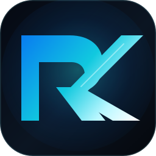

<div align="center">
  

  # Hi, I'm Rajiv Kapur 👋

  ### Software Engineer · Full-Stack & API Development · Cloud & DevOps · Learning AI/ML

  I design and build secure web applications, backend APIs and cloud-ready digital products.

  [](https://rajivkapur.in.net)
  [](https://rajivkapur.info)
  [](https://www.linkedin.com/in/rajiv7kapurk/)
  [](mailto:rajivkapur@sirmint.com)
</div>

---

## About Me

I am a software engineer and founder of **[Sirmint Technology](https://sirmint.com)**, focused on building practical software products from frontend interface to production deployment.

My work includes:

- Full-stack applications with **React, Next.js, TypeScript and Node.js**
- Backend APIs with **FastAPI, ASP.NET Core and Cloudflare Workers**
- Authentication and authorization using **Amazon Cognito and Firebase Auth**
- Database-backed products using **PostgreSQL, Firebase, Supabase and SQL**
- Containerized and cloud deployments with **Docker, AWS, Cloudflare and Vercel**
- CI/CD, API integrations, payment workflows and scalable application architecture
- Ongoing study of **Artificial Intelligence and Machine Learning**

> I focus on shipping useful products while continuously strengthening software architecture, cloud engineering and AI/ML skills.

---

## Current AI & Machine Learning Journey

I am currently learning AI/ML as an extension of my full-stack and backend engineering work.

| Learning Track | Current Topics | Practical Goal |
|---|---|---|
| **Python Foundations** | Python syntax, functions, data structures and notebooks | Write clean data-processing programs |
| **Data Analysis** | NumPy, pandas, data cleaning and visualization | Explore and prepare real datasets |
| **Machine Learning** | Supervised learning, preprocessing and scikit-learn | Train and evaluate baseline models |
| **Model Evaluation** | Accuracy, precision, recall, validation and error analysis | Compare models responsibly |
| **AI Product Integration** | AI APIs, agents, retrieval and application workflows | Add useful AI features to software products |


### Learning Roadmap

- [x] Software engineering and programming foundations
- [x] API development and cloud deployment experience
- [ ] Python for data analysis
- [ ] NumPy and pandas workflows
- [ ] Data preprocessing and exploratory analysis
- [ ] Regression and classification fundamentals
- [ ] Model evaluation and improvement
- [ ] AI-powered full-stack project

---

## Technology Stack

### Languages


### Frontend


### Backend & APIs


### Data, Authentication & Services


### Cloud & DevOps


---

## Selected Product Work

| Product | What It Demonstrates | Technology | Link |
|---|---|---|---|
| **Sirmint Technology** | Multi-product technology platform, shared APIs, authentication and cloud deployment | Next.js, React, FastAPI, Cognito, Docker, AWS | [sirmint.com](https://sirmint.com) |
| **RK Product Lab** | SaaS, CRM, project management, finance and ecommerce product demonstrations | Next.js, React, TypeScript | [rajivkapur.info](https://rajivkapur.info) |
| **Personal Portfolio** | Professional portfolio, project presentation and Cloudflare deployment | React, TypeScript, Vite, Wrangler | [rajivkapur.in.net](https://rajivkapur.in.net) |
| **DealNavo** | Ecommerce and print-on-demand architecture with authentication, payments and fulfillment integrations | React, Firebase, Cloudflare Workers, PayPal APIs | [dealnavo.info](https://dealnavo.info) |

> Most production product repositories are private. Public case studies and working demonstrations are available through the links above.

---

## Engineering Capabilities

| Area | Capabilities |
|---|---|
| **Full-Stack Engineering** | Responsive interfaces, application state, APIs, authentication and database integration |
| **Backend Development** | REST APIs, validation, JWT-based security, service integrations and error handling |
| **Cloud Architecture** | Cloudflare Workers, AWS services, container deployment, environment configuration and domains |
| **DevOps** | Docker, GitHub Actions, build validation and repeatable deployment workflows |
| **Software Architecture** | Modular systems, API contracts, separation of concerns and maintainable codebases |
| **Product Engineering** | Converting business ideas into deployable MVPs and product demonstrations |
| **AI/ML Learning** | Python data workflows, machine learning foundations and AI feature integration |

---

## Current Focus

```text
Software & Product Engineering
├── Full-stack React and Next.js applications
├── Secure FastAPI and ASP.NET Core APIs
├── Cloudflare Workers and AWS deployments
├── Docker and CI/CD workflows
├── Authentication and third-party integrations
├── Python for data analysis
├── Machine learning fundamentals
└── Practical AI features for software products
```

---

## Engineering Principles

- Build secure and maintainable systems
- Prefer clear architecture over unnecessary complexity
- Validate inputs and design predictable API contracts
- Automate repeatable build and deployment work
- Protect credentials and environment secrets
- Optimize for performance, accessibility and reliability
- Measure AI/ML results instead of relying on assumptions
- Use AI responsibly and solve real user problems

---

## Education & Continuous Learning

- **CS50 — Harvard University**
- Artificial intelligence and machine learning fundamentals
- Python, NumPy, pandas, scikit-learn and Jupyter
- Software architecture and system design
- ASP.NET Core, FastAPI and backend engineering
- Docker, CI/CD and cloud-native deployment
- AWS, Cloudflare and distributed systems fundamentals

---

## Let's Connect

I am open to software engineering opportunities, technical collaborations and full-stack product development projects.

- **Portfolio:** [rajivkapur.in.net](https://rajivkapur.in.net)
- **Product Lab:** [rajivkapur.info](https://rajivkapur.info)
- **LinkedIn:** [linkedin.com/in/rajiv7kapurk](https://www.linkedin.com/in/rajiv7kapurk/)
- **Email:** [rajivkapur@sirmint.com](mailto:rajivkapur@sirmint.com)

<div align="center">
  
</div>
